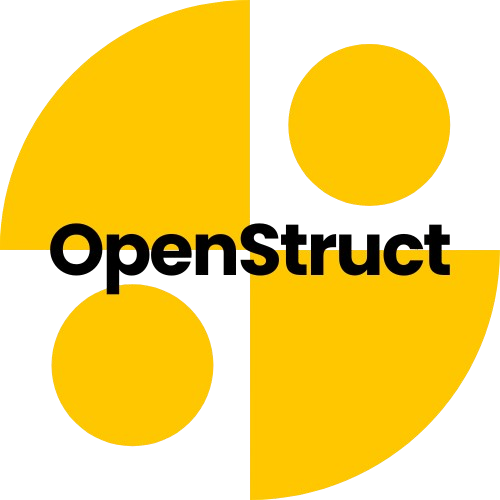

# OpenStruct

**OpenStruct** est un **IDE** pour éditer, visualiser et manipuler facilement des fichiers structurés comme **JSON**, **YAML**, **XML**, **TOML** et **CSV**.  
Développé avec [Electron.js](https://www.electronjs.org/).

 

---

## Fonctionnalités principales

- **Interface multi-fichiers** avec onglets.
- **Interface épurée et responsive**, thème clair/sombre.

## Fonctionnalités principales à venir
- **Éditeur intelligent** avec coloration syntaxique pour JSON, XML, YAML, TOML, et CSV.
- **Conversion instantanée** entre formats.
- **Mudules d'extension**

### Fonctionnalités secondaire à venir
- Drag 'n drop de fichier
- module d'extension
---

## Installation

### Téléchargement rapide

> Les versions pré-compilées sont disponibles dans la section [Releases](https://github.com/Andras-corda/OpenStruct/releases).

### Cloner le projet et lancer localement

```bash
git clone https://github.com/Andras-Corda/OpenStruct.git
cd OpenStruct
npm install
npm run start
```
